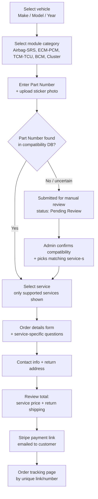

# PRD: Automotive Module Compatibility & Repair Service Platform
 
Sep 22, 2026 · Prepared with @Archie
 
## 1. Overview & Goals
 
**Product.** A web platform that lets vehicle owners and repair shops order module repair/reprogramming services — Airbag/SRS, ECM/PCM, TCM/TCU, BCM, Instrument Cluster — for a Hawaii-based automotive locksmith business. The core experience is a guided compatibility-check wizard, not a flat product catalog: the customer identifies their vehicle and module, the system checks the module's part number against a supported-compatibility database, and only services confirmed compatible with that exact part number are offered for purchase.
 
**Business context.** The business currently handles requests manually by phone/message. This platform replaces that ad-hoc intake with a structured self-service flow, while keeping final compatibility confirmation and pricing under manual admin review for any part number the system doesn't already recognize.
 
**Goals for v1 (MVP).**
 
- Let customers (both individual car owners and auto shops) self-serve from vehicle/module identification through payment, as guests — no account required.
- Prevent payment for a service that turns out to be unsupported, by gating payment behind compatibility confirmation.
- Give the business owner (single admin role) one place to: review new orders, manually confirm compatibility when there is no automatic match, and move each order through fulfillment.
- Run on Vercel's managed serverless platform, with Supabase providing the database, for near-zero, predictable infrastructure cost (Section 7).
**Explicitly out of scope for v1** (full list in Section 11): customer accounts/passwords, warranty or refund workflows, shipping-label API integration, multi-language UI, and a full manual CRUD interface for the compatibility database (which is populated primarily via import).
 
## 2. Target Users & Personas
 
**Guest-only model.** Neither persona creates a password-based account. Every order is placed as a guest and tracked afterward via a unique order link/number plus email — this keeps checkout friction low and removes auth/session management from MVP scope. Both personas use the *same* flow; there is no separate B2B mode, bulk-order UI, or company profile in v1.
 
| Persona | Description | Motivation | Notes |
| --- | --- | --- | --- |
| Car owner (B2C) | An individual whose airbag/SRS, ECM, TCM, BCM or instrument cluster module needs reset, repair or reprogramming, often after an accident or a part swap. | Wants a cheaper, faster alternative to buying a new module from a dealer; needs to be confident the service matches their exact part before paying. | Orders one module at a time; likely a first-time, one-off customer. |
| Auto shop / locksmith (B2B) | A repair shop or independent locksmith sourcing the same module services on behalf of their own customers. | Needs a fast, low-touch way to place possibly repeat orders and get modules turned around reliably. | Places orders one at a time in v1 (no cart/batch orders); may become a repeat guest — repeat handling is by email lookup only, not an account. |
 
**Admin persona.** One business owner/operator acting as a single universal admin: reviews incoming orders, manually confirms compatibility when needed, and updates fulfillment status. No multi-role permission system in v1 (see Section 5).
 
## 3. Core Customer Flow
 
The checkout is a linear wizard. A customer cannot reach payment without passing the compatibility-check step.
 

 
**Step-by-step:**
 
1. **Vehicle selection** — Make → Model → Year.
2. **Module category** — Airbag/SRS, ECM/PCM, TCM/TCU, BCM, Instrument Cluster (Airbag and SRS are a single category).
3. **Compatibility check** — customer enters the Part Number (the catalog part number printed on the module, not its individual serial number) and uploads a photo of the label; a reference example image and upload control are shown. The system looks up the number in the compatibility database.
   - **Match found:** only the services confirmed supported for that exact Part Number are shown next.
   - **No match:** the order is created with status *Pending Review*; the admin is alerted, reviews the submitted photo/number, and either confirms compatibility and the applicable services, or contacts the customer for more information outside the system (Section 9).
4. **Service selection** — options differ per module category and are further filtered by what's confirmed supported for that Part Number (e.g., one ECM may support cloning but not standalone VIN write).
5. **Order details form** — a required free-text field ("describe what's needed and what happened to the module") plus dynamic follow-up questions based on the selected service (Section 4 has the full set).
6. **Contact & shipping** — contact details and return address. Inbound shipping (customer → shop) is free; return shipping is a flat fee added as a line item.
7. **Payment** — the customer does **not** pay at this point. A Stripe payment link is generated and emailed once compatibility is confirmed (auto or manual) and reflects the fixed price tier for the selected service plus the flat return-shipping fee.
8. **Confirmation & tracking** — after payment, the customer gets an order number, a unique tracking link, packing instructions, an order slip to include in the package, and a shipping label if one was included. The tracking page (and duplicate email updates) show order status.
## 4. Customer-Facing Feature Requirements
 
### 4.1 Vehicle & module selection
 
- Cascading selects: Make → Model → Year, sourced from the compatibility database (values that actually have at least one entry, not a generic global vehicle list).
- Module category selection: Airbag/SRS, ECM/PCM, TCM/TCU, BCM, Instrument Cluster.
- **Acceptance criteria:** user cannot advance without selecting Make, Model, Year and a module category; the next step only shows Part Number entry relevant to the chosen category.
### 4.2 Compatibility check
 
- Part Number text input (validated as non-empty; format is manufacturer-specific, so no strict pattern in v1).
- Photo upload (required) of the module's label; an example/reference image is shown beside the upload control.
- On submit, the system searches the compatibility table for an exact Part Number match:
  - **Match:** show the list of services confirmed supported for that Part Number and let the customer continue.
  - **No match:** create the order in *Pending Review* status, notify the admin (Section 9), and show the customer a confirmation that their submission is being reviewed (with the tracking link already issued, even though it isn't paid yet).
- **Acceptance criteria:** a customer can never reach the service-selection step with a Part Number that has zero confirmed-supported services; the system never silently guesses.
### 4.3 Service selection
 
- List of services scoped to (module category + confirmed Part Number). Each shows its fixed price tier ($100 / $200 / $300 / $400 — Section 6/8).
- **Acceptance criteria:** only services the admin/system has explicitly confirmed for this Part Number are selectable.
### 4.4 Order details form
 
- Always-required field: free-text description of what's needed / what happened to the module.
- Conditional fields by selected service:
  - **SRS/Airbag services:** was the vehicle in an accident (yes/no); what error codes are present.
  - **Cloning services:** is the source (original) module available; is a donor module available; Part Numbers and photos of both.
  - **VIN write services:** current VIN, required VIN, vehicle info.
  - **Restoration/recovery services:** does the module currently power on / communicate; what happened right before it failed.
  - For cloning specifically, the confirmation screen must state in plain language exactly which module(s) the customer needs to send in.
  - For any service that requires follow-up work after reinstalling the module in the vehicle, the form asks whether the customer expects to need that follow-up work done and by whom.
- **Acceptance criteria:** the question set shown is driven by the selected service (data-driven, not hardcoded per page), so adding a new service with its own question set doesn't require a new screen.
### 4.5 Contact, shipping, payment
 
- Contact fields: name, email, phone, return shipping address.
- Order summary shows: service price (fixed tier) + return shipping fee ($20–30 flat, configurable by admin) = total. Inbound shipping is called out as free/covered by the business.
- Customer does not pay inline; a Stripe-hosted payment link is emailed after compatibility is confirmed.
- **Acceptance criteria:** no Stripe charge can be created for an order that isn't in a compatibility-confirmed state.
### 4.6 Confirmation & tracking
 
- On order submission (before payment): confirmation screen + email with order number and tracking link.
- On payment (Stripe webhook/redirect): confirmation, packing instructions, an order slip (printable) to include in the package, and a shipping label if the admin attached one for that order.
- Tracking page (by link, no login): shows current status ( see Section 6 for the status list) and lets the customer see it without an account; status is also reflected by the two key transactional emails defined in Section 9.
- **Acceptance criteria:** the tracking link/number is the only credential needed to view an order's status; it must not be guessable (random token, not a sequential order id).
## 5. Admin Panel Requirements
 
Single universal admin role — no permission tiers in v1. Built as authenticated, role-gated routes inside the same Next.js App Router app (e.g. under /admin), protected by Supabase Auth; kept as a distinct route group in the codebase from the public-facing order flow.
 
### 5.1 Orders (CRM-lite)
 
- A sortable/filterable orders table (a Server Component fetching via Prisma, with client-side filter controls) supporting status, email, Part Number and date query params.
- Order detail page: full submitted data (vehicle, module, Part Number, uploaded photos, service, answers to dynamic questions, contact/shipping info, price breakdown, Stripe payment status, current fulfillment status, status history).
- Customer history lookup by email (a lightweight CRM view — no full account, just "all past orders for this email").
- Manual status update control, moving an order through the stages defined in Section 6.
- **Acceptance criteria:** admin can find any order within a couple of clicks by email, order number, or Part Number, and change its status from the detail page.
### 5.2 Compatibility confirmation queue
 
- A dedicated worklist of orders in *Pending Review* (Part Number not auto-matched).
- For each: shows the submitted Part Number, uploaded photo, vehicle info and requested service context.
- Admin action: confirm compatibility and select which service(s) are supported for that Part Number — this both unblocks the order (moves it to *Awaiting Payment*, triggering the Stripe link email) and, ideally, adds/updates the compatibility database entry so future identical Part Numbers auto-match.
- **Acceptance criteria:** confirming an order here is the only way an order in Pending Review can reach Awaiting Payment.
### 5.3 Compatibility database (reference data)
 
- Primary population method: bulk **import** (CSV/spreadsheet) of supported-module lists sourced externally (e.g., programmer-tool manufacturer lists), normalized outside the system before import. A basic import screen with a preview/validation step is in scope for v1.
- A full manual CRUD UI (add/edit/delete individual entries one at a time) is **secondary** — v1 needs at minimum a read-only searchable view of the table plus the ability to add a single new entry inline when confirming a Pending Review order (5.2); a complete standalone CRUD screen is a fast-follow, not MVP-blocking.
- Optional per-entry photo hint (where the module is physically located in the vehicle, what it looks like) — attach an image to a Make/Model/Year/Part-Number entry.
- Table shape (see Section 6 for full data model): Make, Model, Year (or year range), Module Category, Part Number, Supported Services (list), optional photo hint.
### 5.4 Pricing
 
- Fixed price tiers by complexity category ($100 / $200 / $300 / $400), configured centrally (not per-order negotiation).
- Admin can edit the tier amounts and which tier each service maps to.
- Return-shipping flat fee ($20–30) is a single configurable value, not per-order.
- **Acceptance criteria:** changing a tier amount affects future orders' pricing; it does not retroactively change already-quoted/paid orders.
### 5.5 Notifications & alerts
 
- Admin receives an alert on every new order submission (Section 9 covers channel/content).
- No analytics/reporting dashboard in v1 (explicitly descoped per stakeholder input).
### 5.6 Access & auth
 
- Admin authenticates via Supabase Auth (email/password); Next.js middleware checks the Supabase session cookie on every /admin/\* request. Single shared or per-operator login is fine since there is only one role.
- No self-service admin signup — the admin account is created directly in the Supabase Auth dashboard (or via the Supabase Admin API in a one-off script), not through a public sign-up flow.
## 6. Data Model
 
Proposed PostgreSQL schema, hosted on Supabase and defined as a Prisma schema in `/prisma/schema.prisma` (Section 7). Field names/types are a starting point for the dev team, not final DDL — the actual versioned migrations live under `/prisma/migrations`, generated by Prisma Migrate (Section 13). Money fields are stored as integer cents to avoid floating-point rounding; file fields store the URL returned by Vercel Blob rather than the file itself.
 
### vehicles
 
| Field | Type | Notes |
| --- | --- | --- |
| id | BIGSERIAL PK |  |
| make | VARCHAR(50) |  |
| model | VARCHAR(50) |  |
| year | SMALLINT |  |
 
### module\_categories
 
| Field | Type | Notes |
| --- | --- | --- |
| id | BIGSERIAL PK |  |
| name | VARCHAR(50) | Airbag/SRS, ECM/PCM, TCM/TCU, BCM, Instrument Cluster |
 
### compatibility\_entries
 
| Field | Type | Notes |
| --- | --- | --- |
| id | BIGSERIAL PK |  |
| vehicle\_id | BIGINT, FK → vehicles.id |  |
| category\_id | BIGINT, FK → module\_categories.id |  |
| part\_number | VARCHAR(100) | indexed, exact-match lookup |
| photo\_hint\_url | VARCHAR(500), nullable | Vercel Blob URL; where the module sits / what it looks like |
| source | VARCHAR(20) | 'import' or 'admin\_confirmed' — tracks provenance |
| created\_at / updated\_at | TIMESTAMPTZ |  |
 
### services
 
| Field | Type | Notes |
| --- | --- | --- |
| id | BIGSERIAL PK |  |
| category\_id | BIGINT, FK → module\_categories.id |  |
| name | VARCHAR(100) | e.g. "Crash Data Reset", "Cloning", "VIN Write" |
| price\_tier | VARCHAR(10) | '100' / '200' / '300' / '400' |
| question\_set\_code | VARCHAR(30) | drives which dynamic questions render (4.4) |
 
### compatibility\_services (junction)
 
| Field | Type | Notes |
| --- | --- | --- |
| entry\_id | BIGINT, FK → compatibility\_entries.id |  |
| service\_id | BIGINT, FK → services.id | composite PK (entry\_id, service\_id) — which services are confirmed supported for a given Part Number |
 
### price\_tiers
 
| Field | Type | Notes |
| --- | --- | --- |
| tier\_code | VARCHAR(10), PK | '100'/'200'/'300'/'400' |
| amount\_cents | INTEGER | admin-editable |
 
### orders
 
| Field | Type | Notes |
| --- | --- | --- |
| id | BIGSERIAL PK |  |
| tracking\_token | VARCHAR(64), UNIQUE | random, non-sequential — used in the public tracking link |
| status | VARCHAR(30) | see status list below |
| vehicle\_id | BIGINT, FK |  |
| category\_id | BIGINT, FK |  |
| part\_number\_entered | VARCHAR(100) | as typed by customer |
| matched\_entry\_id | BIGINT, FK → compatibility\_entries.id, nullable | set once matched (auto or admin-confirmed) |
| service\_id | BIGINT, FK, nullable until selected |  |
| description | TEXT | required free-text field |
| customer\_name / email / phone | VARCHAR |  |
| return\_address\_\* | VARCHAR | street/city/state/zip |
| service\_price\_cents | INTEGER | snapshot of the tier amount at order time |
| return\_shipping\_fee\_cents | INTEGER | snapshot |
| total\_amount\_cents | INTEGER |  |
| stripe\_payment\_link\_id | VARCHAR(100), nullable |  |
| stripe\_payment\_status | VARCHAR(30), nullable |  |
| shipping\_label\_url | VARCHAR(500), nullable | Vercel Blob URL, if admin attaches one |
| created\_at / updated\_at | TIMESTAMPTZ |  |
 
### order\_photos
 
| Field | Type | Notes |
| --- | --- | --- |
| id | BIGSERIAL PK |  |
| order\_id | BIGINT, FK |  |
| photo\_type | VARCHAR(20) | 'sticker' / 'donor' / 'original' |
| blob\_url | VARCHAR(500) | URL of the uploaded file in Vercel Blob |
| uploaded\_at | TIMESTAMPTZ |  |
 
### order\_answers
 
| Field | Type | Notes |
| --- | --- | --- |
| id | BIGSERIAL PK |  |
| order\_id | BIGINT, FK |  |
| question\_code | VARCHAR(50) | e.g. 'accident\_yn', 'error\_codes', 'current\_vin' |
| answer\_value | TEXT |  |
 
### order\_status\_history
 
| Field | Type | Notes |
| --- | --- | --- |
| id | BIGSERIAL PK |  |
| order\_id | BIGINT, FK |  |
| status | VARCHAR(30) |  |
| changed\_at | TIMESTAMPTZ |  |
| changed\_by | VARCHAR(50) | admin username, or 'system' |
 
**Order status values:** `pending_review` → `awaiting_payment` → `payment_received` → `block_received` → `in_progress` → `ready_shipped_back` (with `completed`/terminal). All six are shown on the customer tracking page; only two transitions trigger an email (Section 9).
 
## 7. Technical Architecture
 
| Layer | Choice | Notes |
| --- | --- | --- |
| Framework | Next.js (App Router), TypeScript | Single deployable app — public wizard, admin panel, and API all live in one Next.js project; no separate backend service |
| Rendering | Server Components for data-heavy pages (orders list, tracking page), Client Components for interactive steps (the wizard, file upload, admin forms) | Standard App Router split; keeps data fetching close to the database and interactivity isolated to where it's needed |
| API surface | Next.js Route Handlers (`/app/api/**`) for webhooks and any endpoint a client needs to call directly; Server Actions for form submissions and admin mutations | No separate REST layer to keep in sync — Server Actions call Prisma directly from the server |
| ORM / DB access | Prisma | Schema-first models in `/prisma/schema.prisma`; Prisma Migrate generates versioned SQL migrations (Section 13) |
| Database | PostgreSQL via Supabase | Supabase hosts the Postgres instance (and its automated backups, on paid tiers — Section 12); Prisma connects through Supabase's connection pooler for serverless-friendly connections |
| Styling | Tailwind CSS | Utility-first; shared design tokens (colors, spacing) for an automotive/locksmith look |
| UI components | shadcn/ui (built on Radix UI primitives) | Accessible, unstyled-by-default components copied into the repo (not an npm dependency), customized with Tailwind |
| Admin panel | Same Next.js app, under an `/admin` route group, protected by Supabase Auth | Shares layout, components and the Prisma client with the public site |
| File storage | Vercel Blob | Photos and shipping labels uploaded via signed, short-lived client tokens (browser → Vercel Blob directly), issued by a Route Handler after server-side validation |
| Payments | Stripe | Official Stripe Node SDK; Payment Links created in a Server Action, Stripe webhook received on a dedicated Route Handler |
| Email | Resend | Called from Server Actions / Route Handlers after the relevant order event; Section 9 has the two transactional emails required for v1 |
| Auth | Supabase Auth (email/password) | No customer accounts — only the single admin role authenticates; session held in an httpOnly cookie, checked by Next.js middleware on `/admin/*`; the public tracking page stays gated by TRACKING\_TOKEN, not auth |
| Deployment | Vercel | Git-push deploys, automatic preview deployments per branch/PR, managed HTTPS and edge network — no containers or servers to manage |
 
### Application layout (Next.js App Router)
 
A route-group split keeps the public wizard, the admin panel, and shared logic clearly separated while staying in one deployable app:
 
```
/app
  /(public)
    /page.tsx                # landing / start of the wizard
    /order
      /vehicle/page.tsx       # Section 4.1 — Make / Model / Year
      /module/page.tsx        # Section 4.1 — module category
      /compatibility/page.tsx # Section 4.2 — Part Number + photo, compatibility check
      /service/page.tsx       # Section 4.3 — service selection
      /details/page.tsx       # Section 4.4 — description + dynamic questions
      /shipping/page.tsx      # Section 4.5 — contact + return address, review
    /track/[token]/page.tsx   # Section 4.6 — public tracking page
  /admin
    /layout.tsx               # checks the Supabase session, renders admin nav
    /orders/page.tsx          # Section 5.1
    /orders/[id]/page.tsx
    /review-queue/page.tsx    # Section 5.2
    /compatibility/page.tsx   # Section 5.3
    /pricing/page.tsx         # Section 5.4
    /login/page.tsx
  /api
    /webhooks/stripe/route.ts # Stripe webhook (Route Handler, verifies signature)
    /uploads/token/route.ts   # issues a signed Vercel Blob upload token
/lib
  /db.ts                      # Prisma client singleton
  /actions                    # Server Actions: placeOrder, confirmCompatibility, advanceStatus, generatePaymentLink
  /domain                     # pure business logic: compatibility matching, pricing snapshot, status transitions —
                              # framework-agnostic functions that Server Actions call into, kept unit-testable in isolation
  /email                      # Resend client + email templates
  /stripe.ts                  # Stripe client wrapper
/components
  /ui                         # shadcn/ui primitives
  /wizard                     # wizard-specific components (FileUpload, StepIndicator, DynamicQuestion)
  /admin                      # admin-specific components (OrdersTable, ReviewQueueCard)
/prisma
  /schema.prisma
  /migrations                 # versioned migration files (Section 13)
middleware.ts                 # Supabase session check for /admin/* routes
```
 
- **Keeping domain logic testable:** the core business rules (compatibility gating, pricing snapshot, status transitions) live as plain functions in `/lib/domain`, taking already-fetched data and returning decisions — Server Actions handle the Prisma calls and orchestration, `/lib/domain` handles the rules. This keeps the rules unit-testable without spinning up Next.js or a database.
- **Server Actions vs. Route Handlers:** Server Actions are used for anything triggered by a form/user interaction inside the app (placing an order, confirming compatibility, updating a status); Route Handlers are used where an external system needs a URL to call (the Stripe webhook) or where the client needs a fetch-able endpoint outside a form submission (requesting a Blob upload token).
### Deployment topology
 
- One Next.js project, deployed to Vercel directly from git; every push to `main` deploys to production, every branch/PR gets its own preview deployment (URL + preview database considerations — Section 12).
- Supabase hosts the Postgres database (and Supabase Auth); Prisma connects via Supabase's pooled connection string, which is required for serverless/edge function connections to avoid exhausting Postgres connections.
- Vercel Blob is provisioned per-project through the Vercel dashboard; no separate credentials to manage outside Vercel's own environment variables.
- No Docker images, VPS, or container orchestration — Vercel builds directly from the Next.js project.
### Integration points to build against
 
- Stripe Payment Links API (create link, retrieve status) + Stripe webhook, verified and handled on a dedicated Route Handler (`/app/api/webhooks/stripe/route.ts`).
- Vercel Blob's client-upload API (`@vercel/blob/client`) for signed, direct-to-Blob uploads from the browser.
- Resend for outbound transactional email.
- Supabase Auth for the admin session; Supabase's Postgres connection (via Prisma) for all data access.
- (Future, not v1) a shipping-rate/label API such as EasyPost or Shippo — `orders` already keeps shipping as a flat snapshot (Section 6), so this slots in as a new module under `/lib` without a schema rework.
## 8. Payment & Shipping Logic
 
### Payment
 
- Pricing is a fixed 4-tier grid ($100/$200/$300/$400) mapped per service — no per-order manual price negotiation.
- Total = service tier price + flat return-shipping fee ($20–30, admin-configurable single value).
- Payment is **gated**: a Stripe Payment Link is only generated once an order reaches a compatibility-confirmed state (either auto-matched at submission, or manually confirmed by the admin from the review queue).
- The link is emailed to the customer (Section 9); the customer is not shown an in-app checkout/card form — Stripe's hosted page handles PCI scope entirely outside the application (Section 10).
- A Stripe webhook updates the order's payment status and advances ORDER.STATUS to `Payment Received`.
### Shipping
 
- **Inbound (customer → shop):** free / covered by the business. No label generation needed for inbound in v1 — customer ships using their own method and the packing instructions provided at order confirmation.
- **Outbound (shop → customer, return):** flat fee ($20–30) added as a separate line item to every order's total; no per-order rate shopping.
- No shipping-carrier API integration in v1 (no EasyPost/Shippo/USPS calls). The admin can optionally attach a shipping label file to an order (uploaded as a BLOB) once ready to ship back; if none is attached, the confirmation flow simply omits that piece.
- **Design note for future-proofing:** keep shipping fields on ORDERS as a flat snapshot now (fee amount, optional label file) so a real rate/label API can be layered in later without restructuring the checkout flow — see Section 7's integration points and Section 11.
## 9. Notifications
 
All customer email is sent via Resend, called from Next.js Route Handlers / Server Actions (Section 7). Kept deliberately minimal for v1 — no automated mid-flow "we need more photos" emails; anything beyond the two triggers below is handled manually by the admin (phone, Telegram/WhatsApp, or a one-off email sent from the admin app).
 
| # | Trigger | Recipient | Priority | Content |
| --- | --- | --- | --- | --- |
| 1 | Order submitted (compatibility match found OR sent to Pending Review) | Customer | High — required for v1 | Order number, unique tracking link, short next-steps note |
| 2 | Compatibility confirmed → Stripe Payment Link generated | Customer | High — required for v1 | Order summary, price breakdown, Stripe payment link |
| 3 | Module received at the shop | Customer | Medium — required for v1 (reduced from 5 status points to 2) | Confirms receipt, order number/tracking link |
| 4 | Order ready / shipped back (+ tracking number if a label was used) | Customer | Medium — required for v1 | Return tracking number if available, order number/tracking link |
| 5 | New order submitted | Admin | High — required for v1 | Order number, customer contact, Part Number/photo, link to the order in the admin app |
 
**Explicitly not automated in v1:** a request-more-photos email, and any email for the intermediate `In Progress` status — the admin/customer handle clarification directly, and the customer is expected to check the tracking page or wait for the final "shipped back" email rather than get a mid-repair update.
 
**Future enhancement (not v1):** a Telegram bot alert to the admin as an alternative/addition to email for new-order alerts (#5).
 
## 10. Non-Functional Requirements & Security
 
- **PCI scope:** the application never touches card data — Stripe's hosted Payment Link page handles all card entry, keeping the application out of PCI DSS scope entirely.
- **Tracking token security:** ORDERS.TRACKING\_TOKEN must be a cryptographically random, non-sequential value (not the numeric ORDER\_ID) so tracking links can't be enumerated or guessed. The public tracking page authorizes solely on token match — no other identity check.
- **Guest data handling:** customer PII (name, email, phone, address) is collected without an account and should be treated as sensitive: restrict admin-app access to authenticated admin users only, and avoid exposing PII on the public tracking page beyond what the customer themselves needs (order status, not e.g. full stored payment details).
- **File uploads:** photo and label uploads are size-limited and MIME-type-restricted server-side (in the Next.js Route Handler that issues the Vercel Blob upload token) before the client uploads directly to Vercel Blob; malware/virus scanning beyond that validation is out of scope for v1.
- **Admin auth:** Supabase Auth, whose refresh-token session persists in an httpOnly cookie without a forced re-login — a good fit for the single-admin, long-lived-login preference; enforce a reasonably strong password policy, and rely on Supabase's own session revocation ("sign out everywhere") as the fallback if credentials are ever compromised.
- **Data retention:** no explicit purge/retention policy requested for v1; note as an open question for the business (Section 12) since customer PII and photos accumulate indefinitely otherwise.
- **Availability:** Vercel and Supabase are both managed platforms with their own uptime SLAs, so there's no VPS or container orchestration to babysit; the one thing to confirm is which Supabase plan tier is used, since automated backups and point-in-time recovery are gated by plan (Section 12).
- **Browser support:** modern evergreen browsers (Chrome, Safari, Edge, Firefox); no legacy browser support required.
- **Accessibility:** rely on shadcn/ui's accessible component primitives (built on Radix UI) and semantic HTML; no additional WCAG conformance target specified — flagged as an open question if the client needs a specific standard.
## 11. MVP Scope vs Future Phases
 
| Feature | v1 (MVP) | Future phase |
| --- | --- | --- |
| Customer accounts | Guest checkout only, tracked by link/token + email | Optional login for repeat B2B customers, if order volume justifies it |
| Compatibility database management | Bulk CSV import + inline add during review-queue confirmation | Full standalone CRUD screen for the compatibility table |
| Shipping | Manual; flat return-shipping fee; optional manually-attached label | EasyPost/Shippo/USPS API integration for automatic rate calc + label generation (inbound and outbound) |
| Admin alerts | Email via Resend | Telegram bot alerts as an alternative/addition |
| Order statuses | 6 stages tracked; only 2 trigger customer emails | Automated email/SMS on every status change, if customer feedback asks for it |
| Warranty / refunds | Not supported | Warranty claim status + refund workflow, if the business adopts a warranty policy |
| Language | English only | Additional languages if the customer base requires it |
| Admin roles | Single universal role | Role-based permissions (e.g., compatibility reviewer vs. shipping operator) if the team grows |
| Analytics/reporting | None | Order-volume and revenue dashboards |
| Clarification requests | Manual (phone/Telegram/WhatsApp/ad-hoc email) | An in-app "request more info" flow with a customer-facing reply form |
 
## 12. Open Questions & Risks
 
- **Compatibility import format/frequency.** Who normalizes the external programmer-tool supported-module lists into an importable format, and how often (one-time seed vs. recurring updates)? This affects whether the import screen needs to support incremental updates/deduping, not just an initial load.
- **Business/legal entity name.** No confirmed business name yet for the site, Stripe account, and email sender identity — needed before design/branding and Stripe onboarding can proceed.
- **Data retention policy.** No stated policy for how long customer PII, photos and order records are kept — recommend the business decide before launch, since Hawaii/US consumer-data handling may have baseline expectations even without a specific regulation cited.
- **Case where compatibility is confirmed but the actual received module differs from what was described** (e.g., wrong Part Number shipped). Not addressed in the current flow — likely handled manually by the admin for v1, but worth a documented fallback (e.g., admin can revert an order to Pending Review after receipt).
- **Order cancellation.** No cancellation/refund path is defined (consistent with "no warranty/refunds" in scope), but even a pre-payment "customer wants to cancel" case needs a manual admin action (e.g., set status to a Cancelled state) — recommend adding a simple Cancelled status even though no refund logic exists.
- **Return-shipping fee tiering.** Confirmed as a single flat $20–30 value; if Hawaii-to-mainland vs. intra-island shipping costs differ meaningfully, a single flat fee could under/over-charge — flagged for the business to confirm before locking the number.
- **Stripe account jurisdiction.** Needs a Stripe account set up for the actual operating business entity/location; not a technical risk but a prerequisite outside engineering's control.
- **Staging vs. production.** Vercel gives every git branch/PR its own preview deployment for free, which covers most staging needs on the app side. Confirm whether a second Supabase project is needed for a fully isolated staging database, or whether a single Supabase project (with a separate schema, or just careful test data) is acceptable for v1.
- **Backup strategy & recovery targets.** Confirm which Supabase plan tier the project runs on, since automated daily backups and point-in-time recovery (PITR) are only available on paid tiers — the Free tier has no automatic backups, which may not be acceptable once the business depends on this data.
## 13. Database Migration Plan (Oracle → PostgreSQL)
 
Since the original build never went live, there's no production data to migrate — this is a schema port, not a data-ETL job. The plan below adapts the original Oracle-flavored schema into a Prisma schema targeting Supabase Postgres.
 
**Type mapping used throughout:**
 
| Oracle type | Prisma / PostgreSQL equivalent |
| --- | --- |
| NUMBER, PK | `BigInt @id @default(autoincrement())` (BIGSERIAL) |
| NUMBER(n) | `Int` / `Int?` (INTEGER/SMALLINT), sized to the actual range |
| VARCHAR2(n) | `String @db.VarChar(n)` |
| CLOB | `String @db.Text` |
| BLOB | *(removed)* — replaced by a `String` column storing the URL returned by Vercel Blob |
| TIMESTAMP | `DateTime @db.Timestamptz` (store everything in UTC) |
| Oracle sequence + trigger for PK | Prisma's native `@default(autoincrement())` |
 
**Migration steps:**
 
1. **Schema port.** Translate each Oracle table into a model in `/prisma/schema.prisma` (target schema in Section 6), then run `npx prisma migrate dev` to generate the first versioned SQL migration under `/prisma/migrations` against a local or Supabase dev database.
2. **BLOB → Vercel Blob.** Every column that stored a file in Oracle (`PHOTO_HINT`, photo/label BLOBs) becomes a `String` URL column instead; the bytes themselves move to Vercel Blob. No files exist yet from the original build, so there's nothing to backfill — this only changes the target schema shape.
3. **Reference/seed data.** The compatibility database (Section 5.3) is populated fresh via the same CSV import mechanism, rebuilt against Supabase Postgres — no data carries over from Oracle since it was never populated in a live system.
4. **Prisma Client alignment.** Prisma generates its typed client directly from `schema.prisma`, so there's no separate model-mapping step — `npx prisma generate` keeps `/lib/db.ts`'s types in sync with the schema on every change. Rely on `prisma migrate dev`/`deploy` as the source of truth rather than manual `db push` once past local prototyping.
5. **Verification.** After running migrations against a fresh Supabase project, verify foreign keys, indexes (especially the `part_number` exact-match index on `compatibility_entries`), and the `tracking_token` uniqueness constraint on `orders` all match the design intent in Section 6.
**If real Oracle data ever does need migrating** (e.g. a pilot was run before this pivot): export each table via `SELECT` → CSV (or Oracle Data Pump), transform BLOB columns by extracting files to disk and uploading them to Vercel Blob (recording the resulting URLs), then bulk-load the transformed CSVs into Supabase Postgres with `COPY` or Supabase's table import UI. Not needed for v1 per current scope — noted here in case that assumption changes.
 
## 14. Implementation Roadmap
 
A suggested build order, front-loading the pieces everything else depends on.
 
**Phase 0 — Foundations**
 
- Next.js project scaffold (App Router, TypeScript, Tailwind, shadcn/ui initialized), Prisma installed and pointed at a Supabase project.
- Prisma schema (Section 6) and first migration (`prisma migrate dev`) against the Supabase dev database.
- Vercel project connected to the git repo; a "hello world" deploy to confirm the pipeline (env vars, Supabase connection string, preview deployments) works end-to-end before real features land.
**Phase 1 — Core domain & admin skeleton**
 
- `/lib/domain` functions for compatibility matching, pricing snapshot, and order status transitions (framework-agnostic, unit-tested).
- Prisma Client wired up in `/lib/db.ts`; basic Server Actions for Vehicle, ModuleCategory, CompatibilityEntry, Service, Order.
- Supabase Auth: admin login page, `middleware.ts` session check on `/admin/*`.
- Basic admin shell (empty orders list page) to prove the auth flow end-to-end.
**Phase 2 — Customer-facing order wizard**
 
- Vehicle/module/part-number pages (Section 4.1–4.2), backed by Server Components querying `vehicles`/`compatibility_entries` via Prisma.
- Compatibility-check Server Action and the Pending Review path.
- Service selection + order-details form with the service-driven dynamic question set (Section 4.4).
- File upload flow (sticker/donor/original photos): Route Handler issues a signed Vercel Blob token, browser uploads directly to Blob.
**Phase 3 — Payment & fulfillment**
 
- Stripe integration: payment link generation (Server Action) gated on compatibility confirmation, webhook handling (Route Handler), `orders.status` transitions.
- Order tracking page (public, token-based).
- Admin: orders list/detail, compatibility confirmation queue, manual status updates.
**Phase 4 — Notifications & polish**
 
- Transactional emails via Resend (order confirmation, payment link, module received, shipped back, admin new-order alert — Section 9).
- Pricing tier management screen, return-shipping fee config.
- Non-functional pass: upload validation limits, Supabase plan-tier decision for backups (Section 10, Section 12).
**Phase 5 — Launch readiness**
 
- Resolve the open items in Section 12 that block go-live (entity name, Stripe account, data retention policy, Supabase staging strategy, Supabase plan tier).
- Smoke-test the full flow against Stripe test mode and a seeded compatibility dataset; cut over to production Stripe keys and real compatibility data.
---
 
*This PRD reflects requirements gathered through a structured intake conversation, later revised to target a Next.js + Prisma + Supabase + Vercel stack (Sections 6, 7, 13). Sections 6, 7, 13 and 14 should be reviewed by the implementing developers before build starts, since concrete Next.js/Prisma patterns (exact Prisma schema fields, Route Handler structure, Supabase RLS policies) may suggest adjustments.*
 
